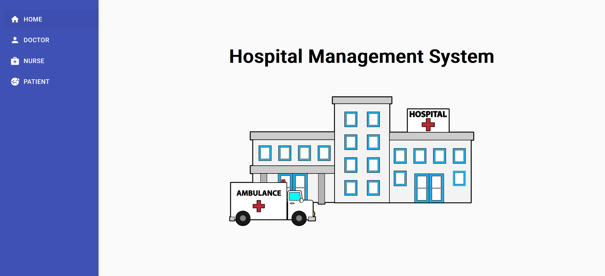
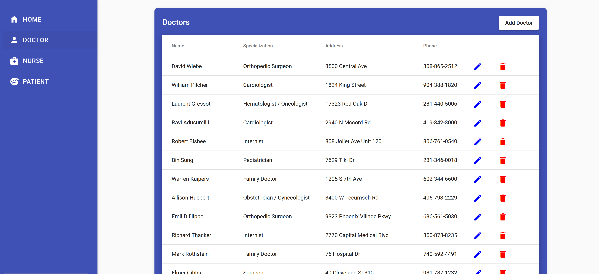

# Hospital Management System

The Hospital Management System (HMS) is a comprehensive solution designed to manage hospital operations efficiently. It helps manage doctors, nurses, patients, and their associated data. The system is built using Node.js for the backend, MongoDB for the database, and Angular for the frontend.



## Installation
1. Clone this repository:
    ```sh
    git clone https://github.com/sixthnovember/Hospital-Management-System.git
    cd Hospital-Management-System/hospital-management-system
    ```
2. Install backend dependencies:
    ```sh
    cd backend
    npm install
    ```
3. Install frontend dependencies:
    ```sh
    cd ../frontend
    npm install
    ```
4. Ensure MongoDB is running on your local machine.
5. Insertig sample data into database:
    ```sh
    cd backend
    node populate.js
    ```
6. Start the backend server:
    ```sh
    cd backend
    node server.js
    ```
7. Start the frontend server:
    ```sh
    cd ../frontend
    ng serve
    ```
8. Open your browser and navigate to http://localhost:4200.



## Usage
1. Adding a Doctor
    * Click on the "Doctor" tab in the sidebar.
    * Click on the "Add Doctor" button.
    * Fill in the doctor's details in the pop-up form.
    * Click "Add".
2. Editing a Doctor
    * Click on the "Doctor" tab in the sidebar.
    * Click the "edit" icon next to the doctor you want to edit.
    * Modify the doctor's details in the pop-up form.
    * Click "Update".
3. Deleting a Doctor
    * Click on the "Doctor" tab in the sidebar.
    * Click th  * e "delete" icon next to the doctor you want to delete.
4. Adding a Nurse
    * Click on the "Nurse" tab in the sidebar.
    * Click on the "Add Nurse" button.
    * Fill in the nurse's details in the pop-up form.
    * Click "Add".
5. Editing a Nurse
    * Click on the "Nurse" tab in the sidebar.
    * Click the "edit" icon next to the nurse you want to edit.
    * Modify the nurse's details in the pop-up form.
    * Click "Update".
6. Deleting a Nurse
    * Click on the "Nurse" tab in the sidebar.
    * Click the "delete" icon next to the nurse you want to delete.
7. Adding a Patient
    * Click on the "Patient" tab in the sidebar.
    * Click on the "Add Patient" button.
    * Fill in the patient's details in the pop-up form.
    * Click "Add".
8. Editing a Patient
    * Click on the "Patient" tab in the sidebar.
    * Click the "edit" icon next to the patient you want to edit.
    * Modify the patient's details in the pop-up form.
    * Click "Update".
9. Deleting a Patient
    * Click on the "Patient" tab in the sidebar.
    * Click the "delete" icon next to the patient you want to delete.